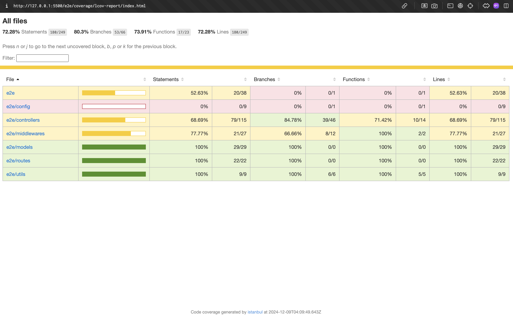

# Jest Example

A simple project showcasing how to set up and use **Jest** for unit testing in JavaScript. This repository includes examples of test cases, best practices, and configuration tips to help you get started with Jest.

---

## About

Jest is a JavaScript testing framework designed for simplicity and performance. This project provides:

- Basic setup for Jest
- Examples of unit tests for JavaScript functions
- Mocking, matchers, and testing async code

---

## Features

- **Easy Setup**: Minimal configuration required.
- **Sample Tests**: Predefined test cases for learning and reference.
- **Best Practices**: Examples of structuring tests and using Jest features.

---

## Setup and Installation

1. Clone the repository:
   ```bash
   git clone https://github.com/[your-username]/jest-example.git
   cd jest-example/e2e
   ```
2. Install Dependencies:
   ```bash
   npm install
   ```
3. Run tests:
   ```bash
   npm run test     # without coverage
   npm run test:cov # with coverage
   ```

## Screenshots


